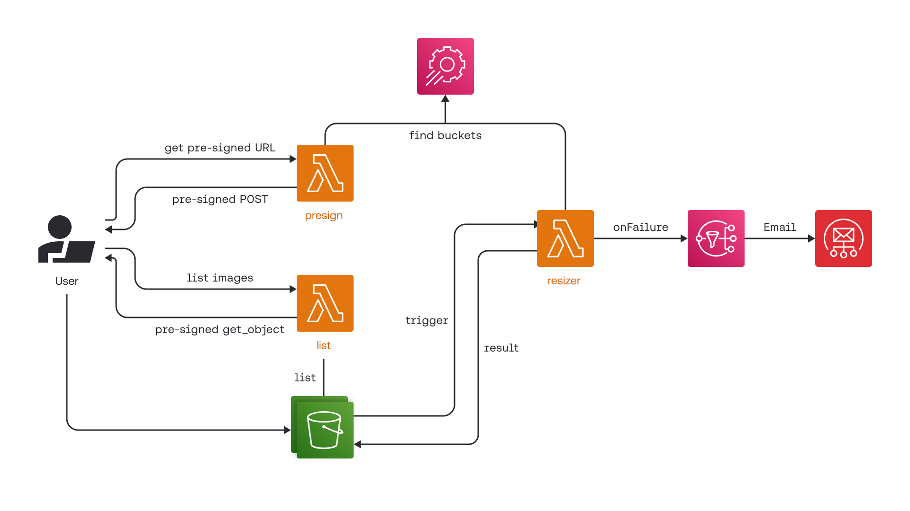

# MiniStack Tutorial

## Introduction

This is an app to resize images uploaded to S3 in a serverless way.
A simple web fronted using HTML and JavaScript provides a way for users to upload images that are resized and listed.
We use a Lambda to generate S3 pre-signed URLs so the upload form can upload directly to S3 rather than going through the Lambda.
S3 bucket notifications are used to trigger a Python Lambda that runs image resizing.
Another Lambda is used to list all uploaded and resized images, and provide pre-signed URLs for the browser to display them.

Here's a short summary of AWS service features we use:

* S3 bucket notifications to trigger a Lambda
* S3 pre-signed POST
* S3 website
* Lambda function URLs

> The tutorial original source is: https://github.com/localstack-samples/sample-serverless-image-resizer-s3-lambda

## Architecture overview



## Run On LBD Cluster

On the LBD cluster you do not need to create a virtual environment and you do not need to run `pip install`.

Start MiniStack in a shell:

```bash
ministack
```

Then in the project directory run:

```bash
bash ./run.sh
```

Open:

```text
https://lbd.tuwien.ac.at/user/$USER/proxy/4566/webapp/index.html
```

## Run Locally

As an alternative to the LBD cluster, you can run the project locally on your machine using MiniStack.

Setup:

```bash
python3 -m venv .env
source .env/bin/activate
pip install -r requirements.txt
```

Start MiniStack in a separate shell, then in the project directory run:

```bash
ministack
```

Then in the project directory run:

```bash
bash ./run.sh
```

Open:

```text
http://localhost:4566/webapp/index.html
```

## Notes

- `run.sh` creates the buckets, deploys the Lambdas, configures bucket notifications, and uploads the frontend.
- At the end of `run.sh`, the script prints the public web URL and the Lambda URLs it generated for the current environment.

## Run integration tests

Once all resources are created on MiniStack, you can run the automated integration tests.

```bash
pytest tests/
```

## Attribution

This project is adapted from LocalStack tutorial https://github.com/localstack-samples/sample-lambda-s3-image-resizer-hot-reload